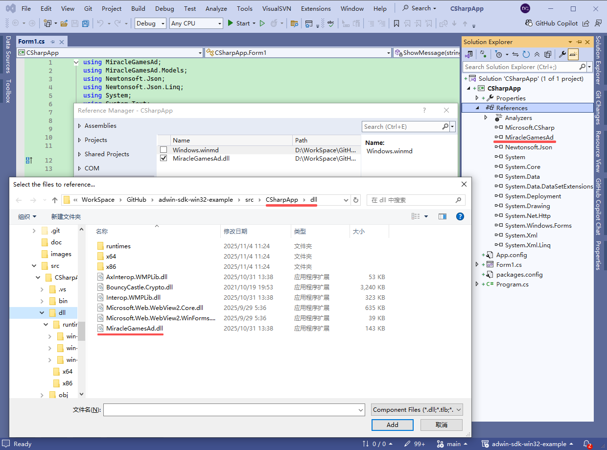
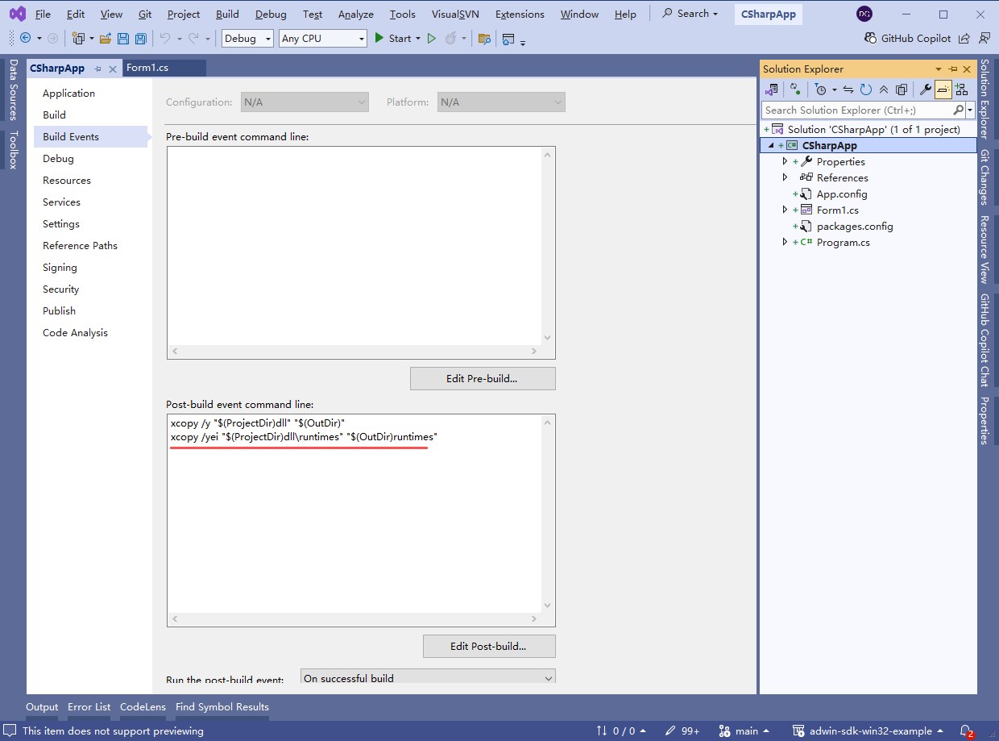

# Miracle Games CSharp SDK

**Other language versions: [English](sdk_csharp.en.md), [中文](sdk_csharp.zh-CN.md).**

**SDK Name:** Miracle Games CSharp SDK

**Company Name of SDK Provider:** Beijing Qiyou Lingdong Technology Co., Ltd.

**Types of Personal Information Processed:** Data actively uploaded by you, device information (device model, operating system version number), network information (network type), application information.

**Purpose of Use and Functional Scenarios:** Provides login, payment, and other related functions.

**SDK Privacy Policy:** [Miracle Games Privacy Policy](https://www.mguwp.net/developer_privacy.html)

**Processing Method:** 1. Ensures security through SSL protocol encryption and HTTPS transmission encryption technology; 2. Processes data with de-identification measures such as encryption and anonymization.

**Compliance Usage Instructions:** [Miracle Games SDK Compliance Usage Guide](https://www.mguwp.net/developer_compliance.html)

---
# Integration and Function Description
### [1. Development Environment Configuration](#1-development-environment-configuration)
### [2. SDK Initialization](#2sdk-initialization)
### [3. Advertisements](#3advertisements)
### [Contact Information](#contact-information-1)
---


# 1. Development Environment Configuration

### 1.1. Add Reference

      Download MiracleGamesAdSDK and extract it to your project folder, such as the dll folder. Add a reference to "MiracleGamesAd.dll" in your project.



### 1.2. Post-Build Event

      Add commands in the post-build event to copy all dll files from MiracleGamesAdSDK to the build output folder.

```plaintext
xcopy /y "$(ProjectDir)dll" "$(OutDir)"
xcopy /yei "$(ProjectDir)dll\runtimes" "$(OutDir)runtimes"
```




# 2.SDK Initialization

### 2.1.Introduction

      Before integrating the Miracle Games SDK, you need to initialize the SDK first. Only after initialization is completed can you use all the features of this SDK in conjunction with the backend system. SDK initialization should be performed when the game starts.


### 2.2.SDK Initialization

```c#
private async void Form1_Load(object sender, EventArgs e)
{
    string message;

    var result = await ApplicationManager.Initialize("YourAppID","YourSecretKey");
    if (result.ReturnValue)
    {
        //Initialization successful.
        message = $"Initialization completed: Token={ApplicationManager.AccessToken.Token}, ExpiresIn={ApplicationManager.AccessToken.ExpiresIn}";

        //Splash screen ad
        AdvertManager.ShowAd(this, "768338453d614f3aad85eea7e3916e7e", AdType.FullScreen);

        //Exit screen ad; Step 1. Load exit ad resources after successful initialization
        AdvertManager.SetupExitAd("7cdc7614b69c4118933e2067e6e14d01");
    }
    else
    {
        message = $"Initialization failed";
    }

    this.Invoke(new Action(() =>
    {
        textBox1.Text = message;
    }));
}
```

### 2.3.Possible reasons for initialization failure include:

　　● Network failure, no proper network connection

　　● This SDK does not support VPN; VPN software is enabled on the device

　　● Incorrect AppId, please check your application settings in the developer backend

　　● Server issues, please check the error information in the result and [contact technical support](contact.en.md) promptly

 
# 3.Advertisements

### 3.1.Introduction

      Before integrating advertisements, you must first complete the SDK initialization.

      Miracle Games advertisements support 【Splash Screen 1920*1080】【Banner 728*90】【Interstitial 1024*768】【Couplet 300*600】【Rewarded Video 1024*768】【Information flow】【Embedded】【Exit Screen】

### 3.2.Splash Screen, Interstitial, Full-screen Interstitial, Banner, Couplet, and Rewarded Video Ads

```c#
//1.Splash screen ad
AdvertManager.ShowAd(this, "768338453d614f3aad85eea7e3916e7e", AdType.FullScreen);

//2.Banner
AdvertManager.ShowAd(this, "e9b34829a2ad4a959874f9a180278bfe", AdType.Banner);

//3.Interstitial ad
AdvertManager.ShowAd(this, "e333abaf22404c4a8d382c1e7ba42076", AdType.Interstitial);

//4.Couplet
AdvertManager.ShowAd(this, "c68cd45e8e374ccd98a704887e5b3582", AdType.Couplet);

//5.Rewarded video
{
    string comment = "id123,abc,$9.99";//Pass-through parameter
    dynamic jsonObj = new
    {
        unitId = "0f505442fac84f098e81d6f2ca04abe1",
        comment = Uri.EscapeDataString(comment)//Pass-through parameter, requires URL encoding
    };
    string json = JsonConvert.SerializeObject(jsonObj);
    AdvertManager.ShowAd(this, json, AdType.Reward);
}

//6.Information flow
{
    //Dimensions are customizable (e.g., 400*50), set in the MG backend.
    dynamic jsonObj = new
    {
        unitId = "6fab0e0912db497cbf886c2c4a9b131c",
        media = "image",
        width = panelAd6.Width,
        height = panelAd6.Height
    };
    string json = JsonConvert.SerializeObject(jsonObj);
    //Developers are responsible for maintaining the ad container.
    AdvertManager.ShowAd(this.panelAd6, json, AdType.InformationFlow);
}

//7.Embedded
{
    //Dimensions are customizable (e.g., 200*200), set in the MG backend.
    dynamic jsonObj = new
    {
        unitId = "e065e44302314b888dcb6074fa6efd69",
        media = "image",
        width = panelAd.Width,
        height = panelAd.Height
    };
    string json = JsonConvert.SerializeObject(jsonObj);
    //Developers are responsible for maintaining the ad container.
    AdvertManager.ShowAd(this.panelAd, json, AdType.Embedded);
}
```

### 3.3.Exit Screen Ad

      The exit screen ad is triggered when exiting the game. To ensure the display rate of the ad when exiting the game, MG implements the exit screen ad in two steps:

      1. After initialization is completed, load the exit screen ad information into memory

      2. When exiting the game, directly display the exit screen ad

```c#
//Exit screen ad
//Step 1. Load exit ad resources after successful initialization
AdvertManager.SetupExitAd("7cdc7614b69c4118933e2067e6e14d01");


// Exit screen ad
// Step 2. Display the exit screen ad when the application is closing
private void Form1_FormClosing(object sender, FormClosingEventArgs e)
{
    _ = AdvertManager.ShowExitAdBlocking();
}
```

### 3.4.Ad Close Event

       Register the callback event for ad closure, typically done in the page constructor.

       Ad close event parameter description:

| Parameter Name | Parameter Description | Example |
| --- | --- | --- |
| unitId | Developer-provided Ad Slot ID | e333abaf22404c4a8d382c1e7ba42076 |
| advertStatus | Ad Slot Status | 1:Ad normal; 2:Ad closed by backend; 3:No ad material |
| The following parameters are only available for rewarded video ads |  |  |
| completeStatus | Ad playback status | 1:Ad playback completed, reward can be issued; 0:Ad playback not completed |
| comment | Pass-through parameter provided by the developer, URL encoded | abc%2c123 |
| rewardId | MG Order ID for the reward, used when the game reports verification after issuing the reward | String |
| resourceId | Resource Id | String |
| materialId | Material Id | String |

```c#
public Form1()
{
    InitializeComponent();
    AdvertManager.AdClickEvent += AdvertManager_AdClickEvent;
    AdvertManager.AdCloseEvent += AdvertManager_AdCloseEvent;
}

private void AdvertManager_AdCloseEvent(object sender, string e)
{
    ShowMessage("Ad closed " + e);

    //Regular ad {"unitId":"6bf68881673540788d096b9ea4a3cedb","advertStatus":1,"resourceId":"68d20656bd9558abfdf43465","materialId":"d235efa86ccf44acbe7053af760031b6"}
    //Rewarded video ad {"unitId":"0f505442fac84f098e81d6f2ca04abe1","advertStatus":1,"completeStatus":1,"resourceId":"68ecb9eb20f045c603867874","materialId":"b0817d87ee2544629bac1933a60238d2","comment":"id123%2Cabc%2C%249.99","rewardId":"D1E593C16BBD412CA880FD89F0450A14"}

    JObject jsonObject = JObject.Parse(e);
    string unitId = (string)jsonObject["unitId"];

    if (unitId == "0f505442fac84f098e81d6f2ca04abe1")//Rewarded video, issue reward items based on the result
    {
        int completeStatus = (int)jsonObject["completeStatus"];
        string resourceId = (string)jsonObject["resourceId"];
        string materialId = (string)jsonObject["materialId"];
        string rewardId = (string)jsonObject["rewardId"];
        string comment = (string)jsonObject["comment"];//Pass-through parameter
        if (completeStatus == 1)
        {
            //Video playback completed, issue reward items 
            //...

            Task.Run(async () =>
            {
                _ = await AdvertManager.ReportAdRewardFulfillment(unitId, resourceId, materialId, rewardId);//Report to MG
            });
        }
    }
}

private void AdvertManager_AdClickEvent(object sender, string e)
{
    ShowMessage("Ad clicked " + e);
}
```


# Contact Information

| Type              | Details                      |
|-------------------|------------------------------|
| 📞 Service Phone  | 86-010-85895781              |
| 📧 Technical Email | Technic@mguwp.com            |
| 🕒 Service Hours   | 10:00 - 19:00                |
